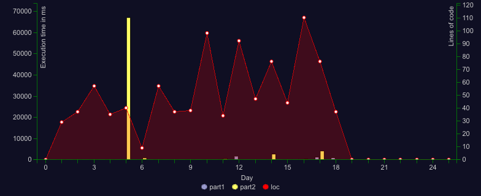

# 🎄 Advent of Code 2023

 


## Stats



## Solutions

<!--SOLUTIONS-->

[](day-01/index.ts)
[](day-02/index.ts)
[](day-03/index.ts)
[](day-04/index.ts)
[](day-05/index.ts)
[](day-06/index.ts)
[](day-07/index.ts)
[](day-08/index.ts)
[](day-09/index.ts)
[](day-10/index.ts)
[](day-11/index.ts)
[](day-12/index.ts)
[](day-13/index.ts)
[](day-14/index.ts)
[](day-15/index.ts)
[](day-16/index.ts)


<!--/SOLUTIONS-->

_Click a badge to go to the specific day._

## Results

<!--RESULTS-->

```
Day 01
Time part 1: 704.17 µs
Time part 2: 2.18 ms
Both parts: 2.88 ms
```

```
Day 02
Time part 1: 917.58 µs
Time part 2: 1.19 ms
Both parts: 2.1 ms
```

```
Day 03
Time part 1: 11.56 ms
Time part 2: 5.16 ms
Both parts: 16.72 ms
```

```
Day 04
Time part 1: 1.76 ms
Time part 2: 1.88 ms
Both parts: 3.64 ms
```

```
Day 05
Time part 1: 501.21 µs
Time part 2: 66970.11 ms
Both parts: 66970.61 ms
```

```
Day 06
Time part 1: 88.87 µs
Time part 2: 787.54 ms
Both parts: 787.63 ms
```

```
Day 07
Time part 1: 8.28 ms
Time part 2: 31.93 ms
Both parts: 40.21 ms
```

```
Day 08
Time part 1: 1.93 ms
Time part 2: 7.01 ms
Both parts: 8.93 ms
```

```
Day 09
Time part 1: 1.8 ms
Time part 2: 2.16 ms
Both parts: 3.97 ms
```

```
Day 10
Time part 1: 8.02 ms
Time part 2: 18.74 ms
Both parts: 26.76 ms
```

```
Day 11
Time part 1: 13.43 ms
Time part 2: 412.9 ms
Both parts: 426.34 ms
```

```
Day 12
Time part 1: 1615.9 ms
Time part 2: -
Both parts: 1615.9 ms
```

```
Day 13
Time part 1: 2.19 ms
Time part 2: 14.62 ms
Both parts: 16.81 ms
```

```
Day 14
Time part 1: 15.18 ms
Time part 2: 2604.73 ms
Both parts: 2619.91 ms
```

```
Day 15
Time part 1: 1.44 ms
Time part 2: 32.82 ms
Both parts: 34.26 ms
```

```
Day 16
Time part 1: 100.73 ms
Time part 2: 278.6 ms
Both parts: 379.33 ms
```

```
Day 17
Time part 1: -
Time part 2: -
Both parts: -
```

```
Day 18
Time part 1: -
Time part 2: -
Both parts: -
```

```
Day 19
Time part 1: -
Time part 2: -
Both parts: -
```

```
Day 20
Time part 1: -
Time part 2: -
Both parts: -
```

```
Day 21
Time part 1: -
Time part 2: -
Both parts: -
```

```
Day 22
Time part 1: -
Time part 2: -
Both parts: -
```

```
Day 23
Time part 1: -
Time part 2: -
Both parts: -
```

```
Day 24
Time part 1: -
Time part 2: -
Both parts: -
```

```
Day 25
Time part 1: -
Time part 2: -
Both parts: -
```

```
Total stars: 31/50
Total time: 72956 ms
```

<!--/RESULTS-->

---

✨🎄🎁🎄🎅🎄🎁🎄✨